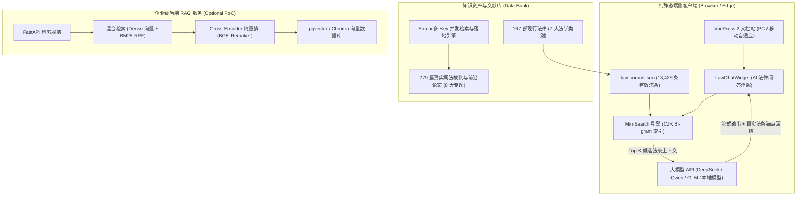

<div align="center">

# JustLaws AI

### 现代化现行法律数字文库 · 纯静态端侧 AI 法律问答 · 权威司法判例与法学文献库

<p align="center">
  <a href="https://github.com/qcmuu/just-laws/actions/workflows/pages.yml"></a>
  
  
  
  
  <a href="https://github.com/qcmuu/just-laws/blob/master/LICENSE"></a>
  <a href="https://github.com/qcmuu/just-laws/pulls"></a>
</p>

<p align="center">
  <a href="#-核心特性">核心特性</a> •
  <a href="#-系统架构">系统架构</a> •
  <a href="#-文库与判例数据概览">数据概览</a> •
  <a href="#-快速开始">快速开始</a> •
  <a href="#-端侧-byok-rag-问答引擎">端侧 AI 问答</a> •
  <a href="#-司法案例与法学文献库">判例文献库</a> •
  <a href="#-上游渊源与致谢">上游致谢</a>
</p>

---

</div>

## 📖 项目简介 (Overview)

**JustLaws AI** 是一个面向法律从业者、法学研究人员及社会公众的现代化、结构化中国现行法律数字化文库与智能知识平台。

项目在极简、纯净的法律文档浏览体验基础之上，深度融合了**端侧纯静态 AI 法律问答（Zero-Backend BYOK RAG）**与**权威司法案例/法学文献知识库（Exa.ai 全网学术检索落地归档）**，提供**条文速查、法意解读、判例比照、法条溯源**的一站式专业法律数字基座。



---

## ✨ 核心特性 (Key Features)

| 核心维度 | JustLaws AI 实现方案 | 技术与业务价值 |
| :--- | :--- | :--- |
| **🤖 端侧智能问答** | 浏览器内 MiniSearch + BYOK 大模型直连 | **零后端运维成本、零用户隐私泄露风险**；API Key 本地加密存储；支持 DeepSeek-R1、通义千问、智谱 GLM 及本地 Ollama。 |
| **🔗 严格法条溯源** | 结构化法条注入 + 原文深链锚点生成 | 彻底抑制大模型法律“幻觉”；答案下方附带**精确法条链接**，一键直达对应法规条文进行真实性比照。 |
| **⚖️ 权威案例与文献** | 279 篇最高法指导案例与 CSSCI 法学论文 | 基于 Exa.ai 语义检索落地保存；每个案例配备元数据 (`meta.yml`)、正文 (`content.md`) 及离线归档 (`source.html`/`.pdf`)。 |
| **⚡ 极致首屏体验** | 彻底关闭切片预取 (`shouldPrefetch: false`) | 消除 VuePress 默认 400+ 个 chunk 预取引发的网络堵塞，弱网与移动端秒级首屏可交互，杜绝“页面假死”。 |
| **📱 全平台响应式** | 现代极简阅读排版 + 暗黑主题隔离 | 采用严谨的法学排版标准，支持多级侧边栏、快捷键全文检索，并对 AI 问答浮窗进行了高对比度深色模式适配。 |
| **🚀 零门槛部署** | GitHub Pages 自动化 Action 一键发布 | 内置 [`.github/workflows/pages.yml`](.github/workflows/pages.yml)，智能识别 Base URL，支持无服务器一键上线。 |

---

## 📊 文库与判例数据概览 (Data Statistics)

### 1. 现行法律收录进度（全库 167 / 308 部，收录率 54.2%）

> 详细各部法律名称与收录状态请见 [`LAWS_PROGRESS.md`](LAWS_PROGRESS.md)。

```
宪法及修正案        [████████████████████] 100.0%  (2/2)
宪法相关法          [████████████████████] 100.0%  (54/54)
民法商法            [████████████████████] 100.0%  (25/25)
行政法              [███████████░░░░░░░░░]  54.2%  (52/96)
经济法              [████████░░░░░░░░░░░░]  38.1%  (16/42)
社会法              [████░░░░░░░░░░░░░░░░]  19.2%   (5/26)
刑法及修正案        [████████████████████] 100.0%   (4/4)
诉讼与非诉讼程序法  [████████░░░░░░░░░░░░]  38.5%  (10/26)
──────────────────────────────────────────────────────────
全库总计            [███████████░░░░░░░░░]  54.2% (167/308)
```

### 2. 权威司法判例与法学学术文献库（共 279 篇完整全文）

> 落地保存于 [`references/`](references/) 目录与文档页 [`docs/references/`](docs/references/)。

| 专题分类 | 篇数 | 核心收录领域与典型案例代表 |
| :--- | :---: | :--- |
| **01. 民商法与民法典专题** | 45 篇 | 最高法合同编通则司法解释案例、人格权侵权裁判要旨、知产惩罚性赔偿、上市公司破产重整计划 |
| **02. 刑法与刑事诉讼专题** | 40 篇 | 正当防卫指导性案例、依法惩治网络暴力与“开盒”案例、特大跨境电信网络诈骗判决、认罪认罚从宽实证 |
| **03. 经济法与金融监管专题** | 36 篇 | 反垄断与反不正当竞争判例、证券虚假陈述民事赔偿、平台经济合规分析、虚开增值税专用发票判例 |
| **04. 行政法与行政诉讼专题** | 35 篇 | 最高法行政诉讼指导案例裁判要旨、政府信息公开纠纷、行政协议履行诉讼、国家赔偿典型案例 |
| **05. 社会法与劳动权益专题** | 36 篇 | 新就业形态劳动者权益保障案例、竞业限制争议规则、工伤认定司法案例、危化品安全生产责任案 |
| **06. 数据安全与 AI 法治专题** | 33 篇 | 全国首例“AI 声音侵权案”判决、AI 文生图著作权案、人脸识别生物信息保护案、算法推荐责任认定 |
| **07. 涉外法治与仲裁海事专题** | 30 篇 | 涉外商事海事仲裁司法审查案例、外国国家豁免法适用研究、国际民商事司法协助送达、跨境破产协助 |
| **08. 宪法与国家治理专题** | 24 篇 | 全国人大常委会规范性文件备案审查典型案例、合宪性审查实践、监察法实施条例职务违法调查案例 |

---

## 🛠️ 快速开始 (Quick Start)

### 1. 环境准备
- Node.js: `>= 18.0.0`
- 包管理器: `npm` 或 `yarn`
- Python: `>= 3.10`（仅在需要运行 Exa 抓取脚本或后端 RAG PoC 时需要）

### 2. 安装与本地运行

```bash
# 1. 克隆代码仓库
git clone https://github.com/qcmuu/just-laws.git
cd just-laws

# 2. 安装 Node.js 依赖
npm install

# 3. 本地启动开发服务器（自动生成 1.3万+ 法条语料并启动 HMR）
npm run docs:dev
```
启动后访问 `http://localhost:8080` 即可浏览文库与使用 AI 问答浮窗。

### 3. 构建生产静态资源

```bash
npm run docs:build
```
构建产物输出于 `docs/.vuepress/dist/`，可直接部署于 Nginx、Apache、Vercel 或 Cloudflare Pages。

---

## 🤖 端侧 BYOK RAG 问答引擎 (Client-Side RAG)

JustLaws AI 创新性地采用**客户端纯静态检索增强生成（Client-Side BYOK RAG）**架构：

```
[ 用户提问 ] 
     │
     ▼
[ MiniSearch 本地召回 ] ──( 毫秒级检索 13,426 条法条 )──► [ Top-K 相关法条上下文 ]
                                                                     │
                                                                     ▼
[ 流式打字机响应 ] ◄──( 端对端通信，无中间服务器 )─── [ 用户大模型 API (DeepSeek/Qwen/GLM) ]
     │
     ▼
[ 智能解析法条引用 ] ──► [ 渲染 Markdown + 生成可点击法律深链锚点 ]
```

### 💡 为什么选择端侧 BYOK 方案？
1. **🛡️ 隐私绝对安全**：用户的 API Key、提问内容仅保存在本地浏览器的 `localStorage` 中，直接与模型官方服务器（如 api.deepseek.com）通信，绝不经过任何第三方中转。
2. **💰 零服务器运维成本**：整个文库本质上是 100% 的纯静态网页，无数据库宕机风险，支持 CDN 全球高速分发。
3. **⚡ 离线检索能力**：法条索引数据在初次加载后即可在客户端常驻，毫秒级快速匹配。

---

## 📚 司法案例与法学文献库 (Exa Harvester)

项目内置了基于 [Exa.ai](https://exa.ai) 的多 Key 轮换高并发法律知识采集脚本 [`harvest_legal_references.py`](harvest_legal_references.py)：

- **高并发轮换**：支持多 API Key 自动故障转移与配额轮转（Round-Robin）。
- **内容清洗与去重**：基于规范化 URL 与正文指纹自动去重。
- **标准化归档三件套**：
  ```
  references/01_民商法_民法典与公司法/案例名称/
  ├── meta.yml        # 包含标题、来源URL、检索词、字符数、相关度评分等
  ├── content.md      # 清洗后的裁判文书 / 文献全文
  └── source.html/pdf # 原始网页或 PDF 归档备份
  ```

---

## 📂 完整目录树 (Project Structure)

```
just-laws/
├── docs/                           # VuePress 文档根目录
│   ├── .vuepress/                  # 站点配置与核心组件
│   │   ├── components/             # LawChatWidget.vue (AI 法律问答组件)
│   │   ├── scripts/                # build-law-corpus.mjs (法条语料构建脚本)
│   │   ├── public/                 # 静态资源 (logo, law-corpus.json)
│   │   ├── config.js               # 导航栏、侧边栏与插件配置
│   │   └── client.js               # 客户端挂载与埋点
│   ├── references/                 # 279 篇司法判例与学术文献导航页
│   ├── category/                   # 法律类别索引页
│   ├── constitution/               # 宪法及修正案
│   ├── constitutional-relevance/   # 宪法相关法（54部）
│   ├── civil-and-commercial/       # 民法商法（25部）
│   ├── administrative/             # 行政法（52部）
│   ├── economic/                   # 经济法（16部）
│   ├── social/                     # 社会法（5部）
│   ├── criminal-law/               # 刑法及修正案（4部）
│   └── procedural/                 # 诉讼与非诉讼程序法（10部）
│
├── references/                     # 本地结构化司法判例与文献知识库（8大专题）
├── rag-poc/                        # 企业级后端 RAG 混合检索 PoC 服务 (FastAPI+pgvector)
├── harvest_legal_references.py     # Exa API 多 Key 并发检索与归档管道
├── LAWS_PROGRESS.md                # 308 部现行法律收录进度与全景表
├── CLAUDE.md                       # AI 助手与开发规范指南
├── README.md                       # 项目主文档
└── package.json                    # 工程配置与脚本定义
```

---

## 📌 上游渊源与致谢 (Upstream & Attribution)

- 本项目 **JustLaws AI** Fork 自优秀开源项目 [ImCa0/just-laws](https://github.com/ImCa0/just-laws)（原作者：[ImCaO](https://github.com/ImCa0)，主站 [justlaws.cn](https://www.justlaws.cn)）。
- 原项目以优雅、极简的风格开创了中国法律数字化的优秀范例。本项目在此基础上扩展了 AI 智能问答、判例文献库与现代工程化体系。
- 谨向原作者 ImCaO 及所有上游代码与法律文本贡献者致以崇高敬意！

---

## ⚠️ 免责声明 (Disclaimer)

1. 本文库收录的所有法律条文、司法解释均整理自全国人大常委会公报、最高人民法院、最高人民检察院及权威官方发布平台，旨在促进法治普及与学术研究，**不具有官方正式文本效力**。正式文本请以全国人大常委会公报及国家法律法规数据库为准。
2. 本项目内置的 **AI 法律问答功能生成的一切解答均由大语言模型计算得出，仅供参考，绝不构成任何正式的法律意见、法律咨询或诉讼指引**。如遇具体法律纠纷，请务必咨询专业执业律师或司法机关。

---

## 📄 授权许可 (License)

本项目遵循 **[MIT License](LICENSE)** 开源授权协议。欢迎自由分发、引用与二次开发。
